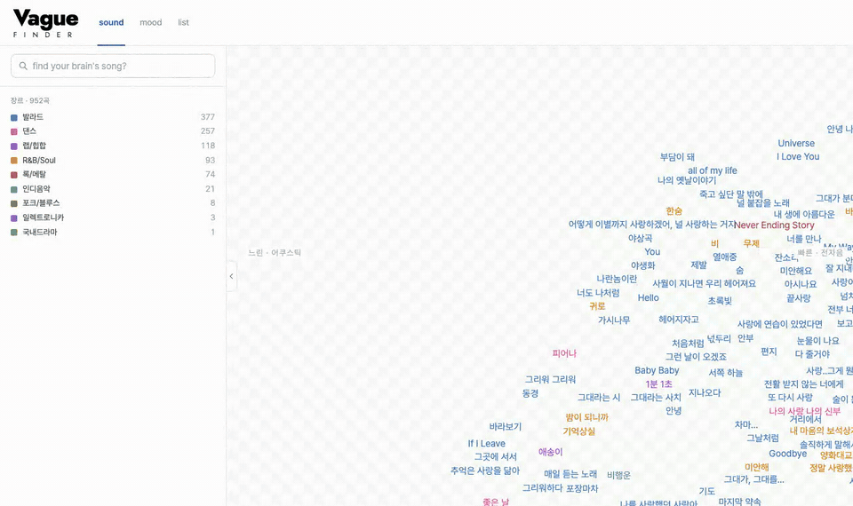
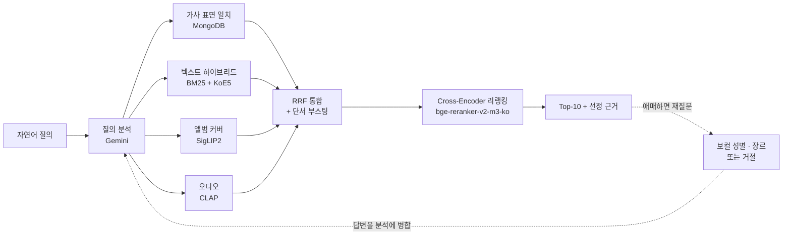

# Vague-Finder

**제목도 가수도 모를 때, 기억의 조각만으로 노래를 찾는 멀티모달 검색 엔진**


> "2000년대 후반에 싸이월드 배경음악으로 엄청 유행했던 곡인데, 여자애들 여러 명이 부르는 빠른 댄스곡이었어.
> 제목이 알파벳 세 글자였던 것 같은데"

키워드 검색은 제목이나 가수를 알아야 하고, 음악 인식은 소리를 들려줘야 한다. Vague-Finder는 그 사이를
메운다. 분위기, 상황, 앨범 커버의 인상, 소리의 느낌, 어렴풋한 가사 한 구절처럼 **모호하고 불완전한 회상
단서**를 자연어로 받아 후보 곡을 찾는다. 한국 대중음악 3,010곡을 대상으로 한 연구용 프로토타입이다.

<p align="center">
  
</p>
<p align="center"><sub>
  소리 지도 → 정서 지도 → 분위기로 검색 → 결과가 지도 위에 표시되고 1위 곡의 선정 근거를 펼친다.
  앨범 커버는 저작권 때문에 흐리게 처리했다.
</sub></p>

## 주요 기능

- **질의 분석** — Gemini가 질의를 가사 조각, 분위기·상황 태그, 커버 이미지 인상, 소리 인상, 시대·보컬 성별 같은
  단서로 나누고 모달리티별 가중치를 정한다
- **멀티모달 병렬 검색** — 가사 표면 일치, 텍스트 하이브리드(BM25 + KoE5), 앨범 커버(SigLIP2), 오디오(CLAP)
  경로를 동시에 돌려 RRF로 합친다
- **리랭킹** — 한국어 Cross-Encoder가 상위 후보를 다시 정렬한다
- **재질문** — 결과가 애매하면 보컬 성별이나 장르를 되묻고, "이 곡 아님"으로 거절하면 그 곡을 빼고 다시 찾는다
- **선정 근거** — 어떤 검색 경로가 순위를 만들었는지 보여 주고, 가사가 근거일 때는 원문 구절을 인용한다
- **노래 맵** — 3,010곡을 소리(CLAP)와 정서(KoE5) 두 기준의 2D 지도로 펼치고, 검색 결과를 지도 위에 표시한다.
  재생은 YouTube 임베드로 한다

## 검색 구조



| 경로 | 모델 · 저장소 |
| --- | --- |
| 질의 분석 | `gemini-3.1-flash-lite` |
| 텍스트 (dense / sparse) | [`nlpai-lab/KoE5`](https://huggingface.co/nlpai-lab/KoE5) / BM25 (Kiwi 형태소 분석) |
| 이미지 | [`google/siglip2-base-patch16-224`](https://huggingface.co/google/siglip2-base-patch16-224) |
| 오디오 | [`laion/clap-htsat-fused`](https://huggingface.co/laion/clap-htsat-fused) |
| 리랭킹 | [`dragonkue/bge-reranker-v2-m3-ko`](https://huggingface.co/dragonkue/bge-reranker-v2-m3-ko) |
| 벡터 DB | Qdrant (로컬 파일 모드 기본, 서버 모드 지원) |
| 가사 정확 일치 | MongoDB (없으면 이 경로만 비고 나머지는 동작) |

## 성능

평가 질의 세트 v06 (팀이 직접 쓴 회상형 질의, dev 57 · test 25)을 3,010곡 코퍼스에서 현재 운영 설정으로 잰 결과다.
**엄격** 지표는 질의를 쓸 때 정한 원래 타깃만 정답으로 세고, **확장** 지표는 팀이 후보를 검토해 더한 허용 정답
(v08 라벨, 질의 20개 · 82곡)까지 정답으로 센다 — 기획의 이중 정답 구조다.

| split | 라벨 | Hit@1 | Hit@5 | Hit@10 | MRR@10 | nDCG@10 |
| --- | --- | --- | --- | --- | --- | --- |
| dev (57) | 엄격 | 0.386 | 0.561 | 0.632 | 0.449 | 0.492 |
| dev (57) | 확장 | 0.491 | 0.719 | 0.772 | 0.571 | – |
| test (25) | 엄격 | 0.400 | 0.560 | 0.560 | 0.460 | 0.475 |
| test (25) | 확장 | 0.480 | 0.680 | 0.680 | 0.551 | – |

- 요청 한 번의 처리 시간은 중앙값 **4.2초**, p95 5.3초다 (dev 57건, 모델 예열 후)
- 952곡 때(dev 엄격 Hit@10 0.789)보다 낮다. 곡 수만 늘린 것이 아니라 수집본·임베딩·색인을 함께 바꾼
  코퍼스 교체 결과이며, 하락이 어디서 왔는지는 아직 나누어 재지 않았다
- test는 여러 번 확인에 쓴 분할이라 새 홀드아웃 검증이 아니라 회귀 확인에 가깝다
- 측정 방법과 근거: [`experiments/reranking/results_v22_corpus3010/RUN_INFO.md`](experiments/reranking/results_v22_corpus3010/RUN_INFO.md)
  · 처리 시간: [`experiments/latency/run_v04_hybrid_payload/RUN_INFO.md`](experiments/latency/run_v04_hybrid_payload/RUN_INFO.md)
  · 952곡 기준선: [`experiments/reranking/results_v21_ce_topn/RUN_INFO.md`](experiments/reranking/results_v21_ce_topn/RUN_INFO.md)

## 기술 스택

| 영역 | 기술 |
| --- | --- |
| Backend |    |
| AI · ML |    |
| Search · Storage |   |
| Data Pipeline |    |
| Frontend |    |
| Infra · Test |   |

## 데이터와 저작권

**이 저장소에는 수집한 곡 데이터가 없다.** 가사·앨범 소개문·댓글 원문과 음원·앨범 커버, 그리고 거기서 뽑은
임베딩 벡터와 곡 목록은 저작물이거나 그 파생물이라 공개하지 않는다. 화면도 음원과 이미지를 직접 호스팅하지 않는다.
재생은 YouTube 임베드에 맡기고 커버는 원본 CDN을 참조한다. 학술 연구 목적의 프로토타입이다.

수집 데이터를 무엇에 어디까지 쓰는지(저작권·초상권), 시연 기준, 예상 질문 답변은
[`docs/data_policy.md`](docs/data_policy.md)에 정리했다.

팀원은 아래 데이터를 팀 드라이브에서 받는다.

| 무엇 | 위치 | 받는 법 |
| --- | --- | --- |
| 곡 폴더 (`meta.json` · `audio.m4a` · `cover.jpg`) | `VAGUEFINDER_DATA_DIR` | 팀 드라이브 (`.env.example` 참고) |
| 곡 레코드 · 임베딩 벡터 | `data/all_songs.jsonl` · `artifacts/embeddings/` | [`docs/vector_backend.md`](docs/vector_backend.md) 절차 |
| 지도 화면 데이터 | `src/frontend/static/map_data.json` | 팀 드라이브 `vague-finder/map_data.json`, 또는 `venv/bin/python -m src.pipelines.build_map` (곡 레코드와 임베딩 필요) |

## 시작하기

**필요한 것**: Python 3.11 이상, ffmpeg (오디오 디코딩), Gemini API 키, 위의 데이터.
Node.js는 수집 파이프라인(yt-dlp)을 돌릴 때만 필요하다.

```bash
# 1. 설치
python3 -m venv venv
venv/bin/pip install -r requirements.txt

# 2. 환경 변수 — GEMINI_API_KEY를 채운다
cp .env.example .env

# 3. 벡터 DB 적재 (data/all_songs.jsonl과 artifacts/embeddings/가 있어야 한다)
venv/bin/python -m src.vector_db.cli.qdrant_load --recreate

# 4. 서버 실행
venv/bin/uvicorn src.backend.main:app --reload
```

| 주소 | 내용 |
| --- | --- |
| `http://127.0.0.1:8000/map` | 노래 맵과 검색 화면 |
| `http://127.0.0.1:8000/docs` | API 문서 |
| `http://127.0.0.1:8000/health` | 서버 상태와 모델 예열 진행 |

```bash
curl -X POST http://127.0.0.1:8000/api/v1/search \
  -H "Content-Type: application/json" \
  -d '{"query": "비 오는 날 혼자 듣기 좋은 잔잔한 발라드", "top_k": 10, "explain": true}'
```

로컬 Qdrant는 저장 폴더를 한 프로세스만 열 수 있다. 서버가 떠 있는 동안에는 적재 명령이 실패한다.

## 개발

```bash
# 테스트
venv/bin/python -m pytest tests/ -q

# 검색 정확도 재측정 — 질의 분석을 캐시로 고정해야 같은 측정이 같은 숫자를 낸다
# 1단계는 캐시가 이미 있으면 빠진 질의만 채운다. 단, 분석기 코드가 바뀐 것을 감지하면
# 전부 다시 분석해 기준선이 달라진다 (--reuse-despite-drift 등은 --help 참고)
venv/bin/python -m src.retrieval.build_analysis_cache --input experiments/reranking/eval_queries_v06.csv \
  --split dev --output experiments/reranking/analysis_cache_v06_dev.json
venv/bin/python -m src.retrieval.evaluate_search_accuracy --input experiments/reranking/eval_queries_v06.csv \
  --split dev --analysis-cache experiments/reranking/analysis_cache_v06_dev.json \
  --output-dir experiments/reranking/results_vNN
```

| 폴더 | 내용 |
| --- | --- |
| `src/backend/` | FastAPI 서버, 요청·응답 스키마 |
| `src/retrieval/` | 질의 분석, 멀티모달 검색 라우터, 리랭킹, 재질문, 선정 근거 기록, 평가 스크립트 |
| `src/embedding/` | KoE5 · BM25 · SigLIP2 · CLAP 임베딩 |
| `src/vector_db/` | Qdrant 적재와 조회 |
| `src/crawler/` | 곡 메타데이터·가사·반응 수집과 LLM 정제 |
| `src/pipelines/` | 노래 맵 좌표 생성 (UMAP) |
| `src/frontend/static/` | 노래 맵과 검색 화면 |
| `experiments/` | 평가 질의 세트, 측정 결과와 실험 기록(`RUN_INFO.md`) |
| `docs/` | 데이터 스키마, 벡터 DB 절차, 협업 규칙 |

- 데이터 스키마: [`docs/data_schemas/music_metadata_schema.md`](docs/data_schemas/music_metadata_schema.md)
- 벡터 DB: [`docs/vector_backend.md`](docs/vector_backend.md)
- 브랜치 · PR 규칙: [`docs/git_convention.md`](docs/git_convention.md)

## 팀 — 애매하지않다

| 이름 | GitHub | 역할 | 담당 |
| --- | --- | --- | --- |
| **황찬혁** (팀장) | [@kuyhxl](https://github.com/kuyhxl) | PM · Full-stack | 일정 조율, 백엔드·프론트엔드 통합, API 연동 |
| **최정현** | [@2020202022](https://github.com/2020202022) | AI · Retrieval | 임베딩 모델 비교, 하이브리드 검색과 리랭킹, 검색 품질 평가 |
| **이연우** | [@yeonwoo0909](https://github.com/yeonwoo0909) | Data Engineer | 크롤링, 데이터 정제, 곡 단위 레코드 설계, DB 적재 |
