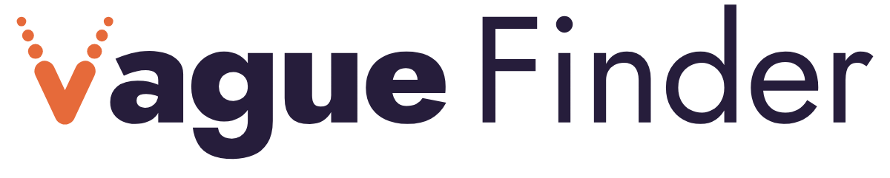
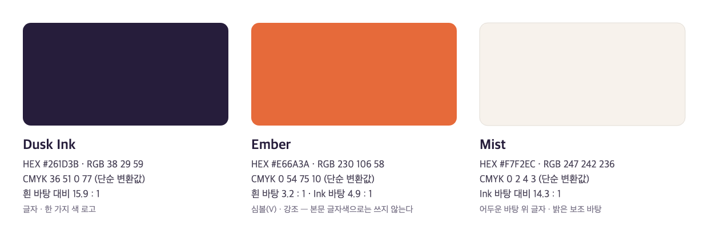
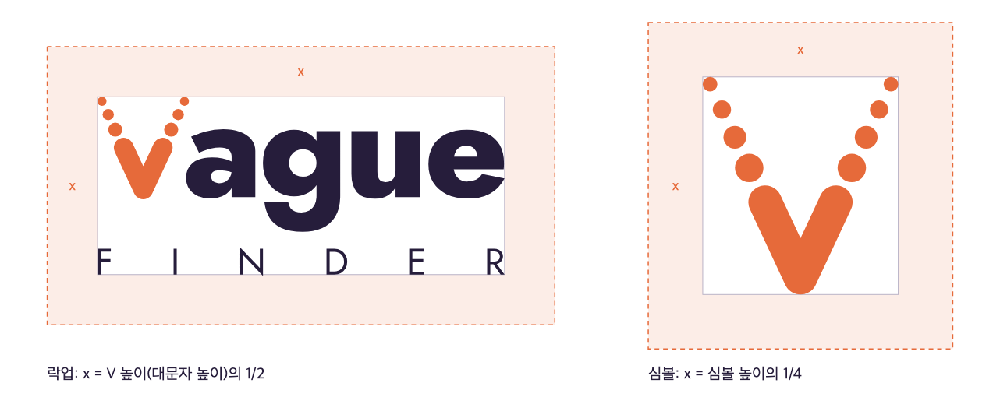
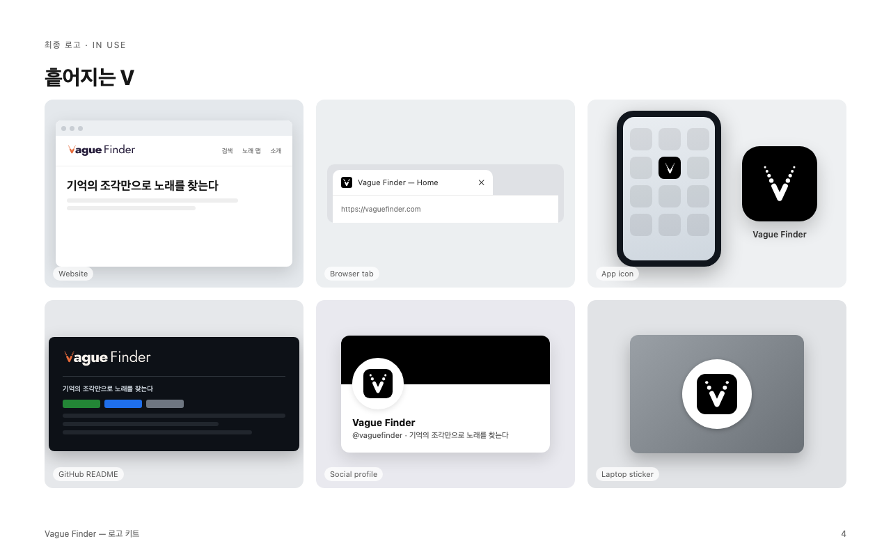

# Vague Finder 로고 가이드

<p align="center"></p>

**흩어지는 V** — 꼭짓점은 또렷한 획이고, 위로 갈수록 점으로 흩어진다. 흐릿한 기억의 조각이 한 곡으로 모이는
순간을 그린 것이다. 점은 노래 맵의 곡 하나하나와 같은 시각 언어이고, 또렷한 꼭짓점은 "정확한", 흩어지는 점은
"몽환적", 둥근 획 끝과 Ember 색은 "따뜻한"을 맡는다.

## 1. 버전

| 버전 | 파일 | 언제 쓰나 |
| --- | --- | --- |
| 두 줄 락업 (기본) | `logo/vaguefinder-stacked.svg` | 사이트 헤더, 발표 표지, 포스터 |
| 한 줄 락업 | `logo/vaguefinder-horizontal.svg` | README 상단, 높이가 낮은 자리 |
| 심볼 | `logo/vaguefinder-symbol.svg` | 48px 이상의 아이콘, 프로필 이미지 |
| 작은 심볼 | `logo/vaguefinder-symbol-small.svg` | 16~47px. 점을 둘로 줄이고 획을 굵혔다 (파비콘은 이 흰 버전을 검정 타일에 얹은 것) |
| 앱 아이콘 | `web/vaguefinder-app-icon.svg` | 검정 타일 위 흰 심볼 |

- 락업의 V는 심볼을 그대로 줄인 것이 아니라 Jost 800 글자 굵기에 맞춰 획을 굵히고 점을 셋으로 줄인 별도 비율이다.
  락업에서 V만 잘라 심볼로 쓰지 말고 심볼 파일을 쓴다.
- 락업에서 V와 단어는 한 덩어리다. 위치나 크기 비율을 바꾸지 않는다.

각 버전에는 색 조합별 파일이 있다.

| 접미사 | 색 | 바탕 |
| --- | --- | --- |
| (없음) | V는 Ember, 글자는 Dusk Ink | 흰색 · 밝은 바탕 |
| `-dark` | V는 Ember, 글자는 Mist | Dusk Ink · 검정 · 어두운 사진 |
| `-ink` | 전부 Dusk Ink | 색을 하나만 쓸 수 있는 밝은 자리 |
| `-black` / `-white` | 전부 검정 / 흰색 | 단색 인쇄, 도장, 자수 |

`-dark`와 `-white`는 어두운 바탕에서 밝은 형태가 굵어 보이는 현상 때문에 획과 글자를 4% 가늘게 그렸다.
PNG(투명 배경)는 `logo/png/`에 있다.

## 2. 색



| 이름 | HEX | RGB | 용도 |
| --- | --- | --- | --- |
| Dusk Ink | `#261D3B` | 38 29 59 | 글자, 한 가지 색 로고 |
| Ember | `#E66A3A` | 230 106 58 | 심볼(V), 강조 |
| Mist | `#F7F2EC` | 247 242 236 | 어두운 바탕 위 글자, 밝은 보조 바탕 |

- 대비: Dusk Ink는 흰 바탕에서 15.9:1이다. Ember는 흰 바탕 3.2:1, Dusk Ink 바탕 4.9:1로 그래픽 요소 기준(3:1)을
  양쪽 모두 넘는다. Ember를 본문 글자색으로 쓰지는 않는다(흰 바탕 4.5:1 미달). Mist 바탕 위 Ember는 2.9:1이라
  Mist 바탕에서는 `-ink` 버전이 더 또렷하다.
- 노래 맵의 장르 색 13개와 겹치지 않도록 로고는 깊은 잉크와 따뜻한 주황 한 가지로 잡았다.
- CMYK는 단순 변환값이다(Ink 36 51 0 77 · Ember 0 54 75 10 · Mist 0 2 4 3). 인쇄할 일이 생기면 교정 출력으로
  확인하고, 별색이 필요하면 실물 Pantone 가이드로 맞춘다.

## 3. 여백



- 락업: 둘레에 **x = V 높이(대문자 높이)의 1/2** 만큼 비워 둔다.
- 심볼: 둘레에 **x = 심볼 높이의 1/4** 만큼 비워 둔다.
- 여백은 로고 크기에 비례한다. 고정 픽셀 값으로 정하지 않는다.

## 4. 최소 크기

| 버전 | 화면 | 인쇄 (권장) |
| --- | --- | --- |
| 두 줄 락업 | 높이 48px | 높이 15mm |
| 한 줄 락업 | 높이 20px | 높이 6mm |
| 심볼 | 48px 이상 | 12mm 이상 |
| 작은 심볼 | 16~47px | 5~12mm |

두 줄 락업은 높이 40px 아래에서 FINDER가 읽히지 않는다. 좁은 자리에서는 한 줄 락업이나 심볼을 쓴다.

## 5. 서체

- 로고: [Jost](https://fonts.google.com/specimen/Jost) ExtraBold 800("ague", "Vague"), Regular 400("FINDER",
  "Finder"). 로고 파일 안의 글자는 모두 윤곽선 패스라 서체 설치 없이 보인다.
- 사이트 본문: Pretendard (지금 사이트 그대로)
- 둘 다 SIL Open Font License라 로고와 웹에 써도 된다.

## 6. 하지 말 것

- 늘이거나 눌러서 비율을 바꾸지 않는다
- 팔레트 밖의 색으로 칠하지 않는다. V와 글자의 색을 서로 바꾸지 않는다
- 기울이거나 돌리지 않는다
- 그림자, 외곽선, 그라데이션, 흐림 효과를 넣지 않는다 (흩어짐은 점으로 이미 표현돼 있다)
- 점의 개수나 크기를 바꾸지 않는다
- 복잡한 사진 위에 그대로 올리지 않는다. 차분한 부분에 `-dark`/`-white`를 쓰거나 Dusk Ink 바탕 위에 둔다
- 로고를 서체로 다시 타이핑하지 않는다. 반드시 파일을 쓴다

## 7. 웹 아이콘

`web/`에 파비콘·웹 아이콘 세트가 있다.

- `favicon.ico` (16·32·48), `favicon.svg`, `favicon-16/32/48.png`: 검정 둥근 타일 위 흰 작은 심볼. 앱 아이콘과 같은
  조합이라 밝은 탭·어두운 탭 어디서나 똑같이 보인다
- `apple-touch-icon.png` (180), `icon-192.png`, `icon-512.png`, `maskable-512.png`: 검정(`#000000`) 타일 위 흰 심볼.
  흰 마크는 어두운 바탕용으로 4% 가늘게 그린 `vaguefinder-symbol-white.svg`다. 매니페스트의 테마 색도 검정이다
- `site.webmanifest`, `head-snippet.html`: `<head>`에 넣을 태그

`head-snippet.html`은 파일이 사이트 루트(`/favicon.ico`)에 있다고 가정한다. 이 프로젝트는 정적 파일을
`/static`으로 내보내므로, 실제 사이트에는 `favicon.ico`·`favicon.svg`·`apple-touch-icon.png`를
`src/frontend/static/icons/`에 복사하고 `index.html`에서 `/static/icons/...?v=1`로 연결했다.
아이콘을 바꾸면 그 폴더에 다시 복사하고 `?v=` 번호를 올린다(브라우저가 파비콘을 오래 캐시한다).

## 8. 목업 보드

`board/board.html`(이미지 내장, 한 파일)과 `board/slides/*.png`에 웹사이트·브라우저 탭·앱 아이콘·README·
프로필·스티커 목업이 있다. `board/spec.json`을 고치고 다시 만들 수 있다.



## 9. 다시 만들기

로고 마스터와 가이드 도해는 `build.py` 하나로 만든다. 형태 값(팔 기울기 25°, 획 두께, 점 크기·간격)과 색은
파일 맨 위에 모여 있다.

```bash
pip install fonttools uharfbuzz brotli          # 프로젝트 requirements에는 없다
# Jost 가변 서체를 받아 wght 380·400·770·800 인스턴스를 Jost-<wght>.ttf로 만든 뒤
python docs/brand/build.py --fonts <Jost-*.ttf 폴더>
```

웹 아이콘·PNG·목업 보드는 로고 디자인 스킬의 `export_variants.py`, `render_png.py`, `presentation_board.py`로
만들었다.

## 10. 인계 메모

- **테스트:**
  - 심볼·작은 심볼·두 락업 모두 SVG 점검을 통과했다(라이브 텍스트·래스터·필터 없음, 색 1~2개)
  - 두 줄 락업에서 나오는 각도 경고(46.4°)는 FINDER의 N 사선, 즉 Jost 글자 자체라 고칠 대상이 아니다
  - 16/32/48px 픽셀 테스트, 반전, 한 가지 색, 흐리게 보기, 회전, 밝은·어두운·사진·패턴 바탕을 확인했다
- **남은 일:**
  - 상표 검색 — 기존 로고와의 충돌 여부는 보장하지 않는다. 확정 전에 상표 DB와 이미지 역검색으로 확인한다
  - 사이트 헤더 락업 적용 (`src/frontend/static/index.html`). 파비콘은 적용했다
  - 인쇄가 필요하면 CMYK 교정과 별색 매칭
- `concept-a/`는 승인한 컨셉 원본(보관용)이다. 키트의 기준은 `logo/`다.
